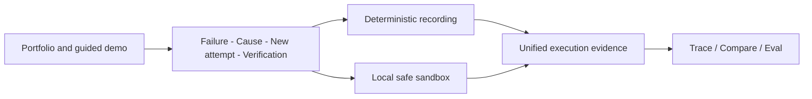

# AgentScope | Agent Failure Replay and Fix Verification

[](https://github.com/ZackZhang-AI/AgentScope/actions/workflows/ci.yml)
[](./LICENSE)
[](./CHANGELOG.md)

[Live Demo](https://agentscope-harnesslab.vercel.app/demos/code-fix-loop) · [English Video](https://github.com/ZackZhang-AI/AgentScope/releases/download/v0.3.4/agentscope-90-second-demo-en.webm) · [Chinese Video](https://github.com/ZackZhang-AI/AgentScope/releases/download/v0.3.4/agentscope-90-second-demo-zh.webm) · [Product Case](https://agentscope-harnesslab.vercel.app/case-study) · [中文 README](./README.md)

AgentScope is an AI agent black-box product prototype. It helps agent teams explain why a run failed, create a safe new attempt and verify the result with execution evidence.

[](https://agentscope-harnesslab.vercel.app/demos/code-fix-loop)

## The user problem

A failed agent often leaves teams with a wrong final answer or a large event log. The useful product questions are smaller:

- Where did the agent stop making progress?
- Which failure is actionable?
- How can a team retry without overwriting the original run?
- Did the new strategy fix the task without adding a regression?

The primary users are agent product owners, developers and quality owners shipping agent-powered products.

## The 90-second journey

The public walkthrough uses a deterministic code-repair case and needs no API key, database or Docker.

| User decision | Question | Product output |
| --- | --- | --- |
| See the failure | What did the agent try and where did it stop? | A short action path and first failure |
| Explain the cause | Why did repeated work not help? | A no-progress explanation and raw evidence |
| Create a new attempt | How can recovery preserve history? | A safety check and separate child attempt |
| Verify the result | Did it work and what did it cost? | Tests, regressions, cost comparison and a product brief |

The verified result can generate a bilingual Markdown product brief for product, engineering and quality owners. The complete Trace stays hidden until the reviewer explicitly opens technical evidence.

## Product shape

AgentScope has two layers:

1. **Product story:** the homepage, guided demo, product brief and case study explain the problem, decision, outcome and trade-off in plain language.
2. **Technical evidence:** the advanced workbench and run detail retain raw spans, tool calls, artifacts, checkpoints, comparison and evaluation.

Key routes:

- `/`: product portfolio homepage.
- `/demos/code-fix-loop`: guided English walkthrough.
- `/zh/demos/code-fix-loop`: guided Chinese walkthrough.
- `/case-study`: product case study.
- `/workbench`: local sandbox and advanced technical entry.
- `/runs/:runId`: refreshable run detail.

## Product decisions

| Decision | Why | Trade-off |
| --- | --- | --- |
| Evidence before conclusions | Every finding should be traceable | More trace structure, but no opaque overall score |
| Recovery preserves history | The failed run remains a trustworthy baseline | More storage and comparison logic |
| One safe scenario first | Arbitrary repositories expand isolation risk | Less breadth, but reproducible safety claims |

## My contribution

I led the problem framing, target-user definition, product flow, interaction design, system architecture, full-stack implementation, test strategy and release acceptance.

AI assisted coding and review. Product judgment, scope control and final verification remained human-owned.

## Targets and verified results

Product targets are kept separate from current evidence. The project does not claim live adoption or business growth.

| Type | Statement |
| --- | --- |
| North-star metric | Verified-fix completion rate |
| Product verification | The recorded case completes failure, diagnosis, recovery and verification |
| Engineering verification | Parent stays immutable, Child passes the target test and conclusions link to evidence |
| Decision output | The bilingual product brief can be copied, downloaded and linked back to technical evidence |
| Public access | Recorded-only deployment needs no key, PostgreSQL or Docker |
| Quality budget | Performance ≥ 90, Accessibility ≥ 95, LCP ≤ 2.5 seconds |

## Architecture



The implementation remains a Next.js + PostgreSQL modular monolith. Models select validated allowlisted actions; the server owns file and test permissions.

## Quick start

```bash
npm install
npm run dev
```

Open `http://localhost:3000/demos/code-fix-loop`. The recorded walkthrough needs no key, database or Docker.

Local sandbox setup is documented in the [operations guide](./docs/agentscope-operations.zh-CN.md).

## Boundaries and next step

The current project executes only the built-in `buggy-auth-api` scenario. It does not include arbitrary repositories, authentication, RBAC, billing, datasets, independent workers or queues.

The next product step is validating whether target users understand the guided flow before expanding runtime breadth.

## Verification

```bash
npm run typecheck
npm run lint
npm test
npm run eval
npm run build
npm run smoke:recorded
npm run e2e
npm run lighthouse
npm audit --omit=dev
```

## Documentation

- [Full PRD](./docs/agentscope-prd.zh-CN.md)
- [Architecture](./docs/architecture.zh-CN.md)
- [Implementation status](./docs/agentscope-implementation-status.zh-CN.md)
- [Operations and security](./docs/agentscope-operations.zh-CN.md)
- [Job-search kit](./docs/job-search-kit.zh-CN.md)
- [Changelog](./CHANGELOG.md)

## License

[MIT](./LICENSE)
