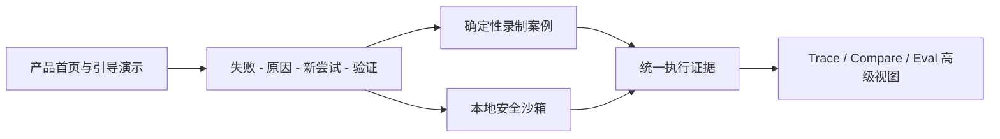

# AgentScope | AI Agent 失败回看与修复验证

[](https://github.com/ZackZhang-AI/AgentScope/actions/workflows/ci.yml)
[](./LICENSE)
[](./CHANGELOG.md)
[](https://nextjs.org/)

[在线演示](https://agentscope-harnesslab.vercel.app/zh/demos/code-fix-loop) · [中文视频](https://github.com/ZackZhang-AI/AgentScope/releases/download/v0.3.4/agentscope-90-second-demo-zh.webm) · [英文视频](https://github.com/ZackZhang-AI/AgentScope/releases/download/v0.3.4/agentscope-90-second-demo-en.webm) · [产品案例](https://agentscope-harnesslab.vercel.app/zh/case-study) · [English README](./README.en.md)

AgentScope 是一个 AI Agent 黑匣子产品原型。它帮助 Agent 产品团队解释一次运行为什么失败，从安全位置创建新尝试，并用执行证据验证修复是否有效。

[](https://agentscope-harnesslab.vercel.app/zh/demos/code-fix-loop)

## 项目要解决的问题

Agent 执行失败后，团队通常只能看到错误的最终答案或大量原始日志。真正需要回答的是：

- Agent 在哪里停止产生进展？
- 哪一步最值得采取行动？
- 如何重试，同时保留原始失败记录？
- 新策略是否修复了问题，是否引入新回归？

核心用户是正在交付 Agent 产品的产品负责人、开发者与质量负责人。

> 当一次 Agent 运行失败时，帮我找到第一个可行动的原因，安全创建新尝试，并证明结果是否得到改善。

## 90 秒产品流程

公开演示使用一个确定性的代码修复案例，无需 API Key、数据库或 Docker。

| 用户决策 | 页面回答的问题 | 产品输出 |
| --- | --- | --- |
| 看见失败 | Agent 做了什么，任务停在哪里？ | 简化执行路径与首次失败 |
| 解释原因 | 为什么反复执行仍没有成功？ | 无进展重复与原始证据 |
| 创建新尝试 | 如何恢复且不覆盖原记录？ | 安全恢复检查与独立 Child |
| 验证结果 | 修复是否有效，代价是什么？ | 测试、回归、成本对比与产品复盘摘要 |

验证完成后可一键生成中英文产品复盘摘要，复制或下载 Markdown，与产品、研发和质量负责人共享。完整 Trace 不会在演示开始时直接铺开，只有用户主动选择“查看完整技术证据”后才显示技术细节。

## 产品形态

AgentScope 提供两层体验：

1. **产品叙事层**：首页、90 秒演示、产品复盘摘要和 Case Study 使用自然语言解释问题、决策、结果与取舍。
2. **技术证据层**：高级 Workbench、Run Detail 和 Trace Explorer 保留完整输入输出、工具调用、Artifact、Checkpoint 与评测证据。

主要入口：

- `/`、`/zh`：产品作品集首页。
- `/demos/code-fix-loop`：英文引导演示。
- `/zh/demos/code-fix-loop`：中文引导演示。
- `/case-study`、`/zh/case-study`：双语产品案例。
- `/workbench`：本地沙箱和高级技术工作台。
- `/runs/:runId`：可刷新恢复的运行详情。

## 三个关键产品决策

| 决策 | 原因 | 取舍 |
| --- | --- | --- |
| 先给证据，再给结论 | 每条诊断和验证结果都应可追溯 | 需要更完整的 Trace 结构，但避免不透明总分 |
| 新尝试不能覆盖历史 | 原始失败必须继续作为可信基线 | 存储与比较更复杂，但修复结果可审计 |
| 先做好一个安全案例 | 任意仓库执行会扩大隔离和供应链风险 | 展示范围更窄，但所有安全声明可复现 |

## 我的角色与贡献

这是一个由我主导的独立项目。我负责：

- 问题定义、目标用户、核心流程与产品范围。
- 交互设计、双语体验和 90 秒作品集叙事。
- Trace、恢复、对比与确定性验证的系统设计。
- Next.js 全栈实现、测试门禁、部署和发布验收。

AI 参与编码和审查辅助。产品判断、架构选择、范围控制和最终验收由我负责。

## 产品目标与已验证结果

产品目标与当前结果分开表达，不把目标指标包装成线上用户数据。

| 类型 | 内容 |
| --- | --- |
| 北极星指标 | 可验证修复完成率：用户从失败证据进入新尝试，并完成结果验证的比例 |
| 当前产品验证 | 录制案例可完成失败、定位、恢复和验证的完整闭环 |
| 当前工程验证 | Parent 保持不可变，Child 通过目标测试，结论关联原始操作证据 |
| 决策交付物 | 双语复盘摘要可复制、下载和跳转到对应技术证据 |
| 公开访问 | Recorded-only 模式无需 Key、PostgreSQL 或 Docker |
| 质量预算 | Performance ≥ 90、Accessibility ≥ 95、LCP ≤ 2.5 秒 |

项目没有公开用户增长或商业化数据，因此不声明虚假的采用率与业务收益。

## 简化架构



技术实现继续采用 Next.js + PostgreSQL 模块化单体。模型只能选择经过校验的白名单动作，测试命令和可修改文件由服务端控制。完整说明见[架构文档](./docs/architecture.zh-CN.md)和[运行与安全手册](./docs/agentscope-operations.zh-CN.md)。

## 快速开始

只体验录制演示：

```bash
npm install
npm run dev
```

打开 `http://localhost:3000/zh/demos/code-fix-loop`。不需要 Key、数据库或 Docker。

本地真实沙箱需要 PostgreSQL 与 Docker：

```bash
docker compose up -d
copy .env.example .env.local
npm run db:migrate
npm run dev
```

详细配置见[运行与安全手册](./docs/agentscope-operations.zh-CN.md)。

## 当前边界与下一步

当前只执行仓库内置的 `buggy-auth-api` 案例，不支持任意仓库、登录、RBAC、多租户、计费、Dataset、独立 Worker 或消息队列。

下一步优先验证：

1. AI 产品负责人能否在 90 秒内理解问题、原因、恢复和验证。
2. 自然语言摘要是否足以降低首次使用门槛。
3. 技术评审者是否仍能快速进入完整证据层。

验证用户流程后，再考虑扩大 Agent Runtime 的接入范围。

## 质量验证

```bash
npm run typecheck
npm run lint
npm test
npm run eval
npm run build
npm run smoke:recorded
npm run e2e
npm run lighthouse
npm audit --omit=dev
```

## 文档

- [完整产品设计文档](./docs/agentscope-prd.zh-CN.md)
- [架构说明](./docs/architecture.zh-CN.md)
- [实现状态](./docs/agentscope-implementation-status.zh-CN.md)
- [运行与安全手册](./docs/agentscope-operations.zh-CN.md)
- [求职展示材料](./docs/job-search-kit.zh-CN.md)
- [更新日志](./CHANGELOG.md)

## License

[MIT](./LICENSE)
