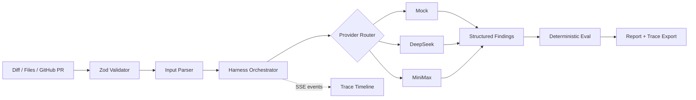

# HarnessLab：代码 Agent 审计工作台

[](https://github.com/ZackZhang-AI/HarnessLab/actions/workflows/ci.yml)
[](./LICENSE)
[](https://nextjs.org/)

[English README](./README.en.md) | [架构说明](./docs/architecture.zh-CN.md)

HarnessLab 是一个面向代码审查场景的 AI Agent Harness 工作台。它把粘贴的
diff、代码片段或公开 GitHub Pull Request 转换为实时审计轨迹、结构化风险发现、
确定性质量评分以及可交付的审查报告。

它不是普通 AI Chat UI，也不是简单的模型套壳。模型负责发现问题，Harness 负责
输入约束、任务编排、过程观测、结果校验、质量评估和报告导出。


## 核心能力

- 实时 SSE 审计轨迹：`intake -> plan -> inspect -> finding -> evaluate -> report`
- 输入支持 unified diff、file snippets 和公开 GitHub PR
- Provider 支持确定性 Mock、DeepSeek 与 MiniMax
- 可选择安全、可靠性、测试、可维护性和性能审查规则
- Zod 约束请求及模型输出，异常 JSON 支持一次提取恢复
- Harness 独立生成 Eval Card，避免模型自评
- 记录 Provider、模型、耗时、Prompt 版本和 Token 用量
- 导出 Markdown 报告、JSON Trace，复制可直接用于 PR 的审查评论
- 最近审计会话保存在浏览器 localStorage
- 内置可复现 Mock 评测集，并由 CI 持续验证
- 无 API Key 时也可通过 Mock Demo 完整演示

## 快速开始

要求 Node.js 22 或更高版本。

```bash
npm install
npm run dev
```

打开 `http://localhost:3000`，选择任意示例并运行 `Mock Demo`。

## 模型配置

复制 `.env.example` 为 `.env.local`，按需填写：

```bash
DEEPSEEK_API_KEY=
DEEPSEEK_MODEL=deepseek-v4-flash

MINIMAX_API_KEY=
MINIMAX_MODEL=MiniMax-M2.7

# 可选：提高公开 PR 导入时的 GitHub API 限额
GITHUB_TOKEN=
```

所有模型请求均发生在服务端，API Key 不会发送到浏览器。DeepSeek 和 MiniMax
共用 OpenAI-compatible 适配层，但保留独立的地址、密钥和默认模型配置。

## 工作原理



模型只返回：

```text
summary + riskScore + findings
```

时间线、Eval Card、运行指标和报告由 Harness 生成。这一边界让结果更可追溯，
也让 Mock、DeepSeek、MiniMax 可以在同一评价体系下比较。

## API

`POST /api/audit`

```json
{
  "content": "diff --git ...",
  "inputType": "diff",
  "provider": "mock",
  "intensity": "standard",
  "rules": ["security", "reliability", "testing"]
}
```

普通请求返回完整 JSON；带 `Accept: text/event-stream` 时会依次返回 `trace`、
`result` 或 `error` 事件。

`POST /api/github/pr` 只接受形如
`https://github.com/owner/repo/pull/123` 的公开 PR 地址。服务端仅访问固定的
GitHub API 域名，并限制导入内容不超过 60,000 字符。

## 质量验证

```bash
npm run typecheck
npm run lint
npm test
npm run eval
npm run build
npm run e2e
npm audit --omit=dev
```

当前自动化覆盖：

- 请求、响应和内容长度校验
- diff 与文件片段解析
- Mock 启发式规则和确定性评测集
- DeepSeek JSON 提取与错误处理
- SSE trace 到最终结果的完整链路
- GitHub PR 地址约束与导入
- 报告生成、导出、会话恢复及移动端主要流程

## 项目结构

```text
app/api/               API Route 与 SSE 输出
components/            工作台交互界面
lib/audit/             编排、事件与确定性评估
lib/providers/         Provider 适配层
lib/evals/             可复现评测数据集
tests/                 单元与 API 测试
e2e/                   Playwright 浏览器测试
docs/                  中文工程说明
```

## 求职项目表达

> 基于 Harness Engineering 范式设计并实现 HarnessLab 代码 Agent 审计工作台。
> 项目支持多 Provider 路由、SSE 实时审计轨迹、Zod 结构化输出约束、确定性质量
> 评估、公开 GitHub PR 导入和可复现评测集，将一次模型调用扩展为可观察、可验证、
> 可交付的代码审查产品流程。

建议重点讲清三个工程决策：

1. 为什么模型不能给自己的审计过程打分。
2. 为什么 Provider 输出要和 Harness 事件、报告解耦。
3. 为什么公开 Demo 必须有稳定、无 Key、可复现的 Mock 路径。

## 范围边界

当前版本聚焦审计工作台，不执行自动改代码、不提交 PR、不接入私有仓库 OAuth，
也不保存服务端数据库。安全修复建议仍需开发者确认。

## 参与贡献

欢迎通过 Issue 提交样例、审查规则或 Provider 适配建议。提交代码前请确保上述
质量命令全部通过，并保持一次提交只解决一个明确问题。

## License

[MIT](./LICENSE)
