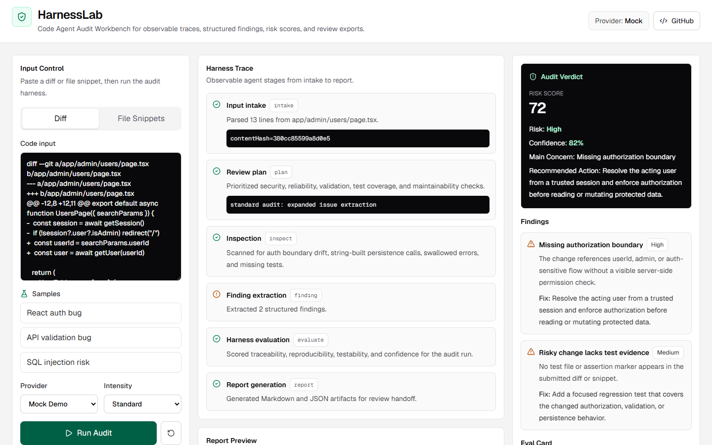
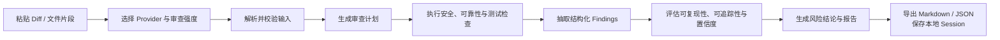
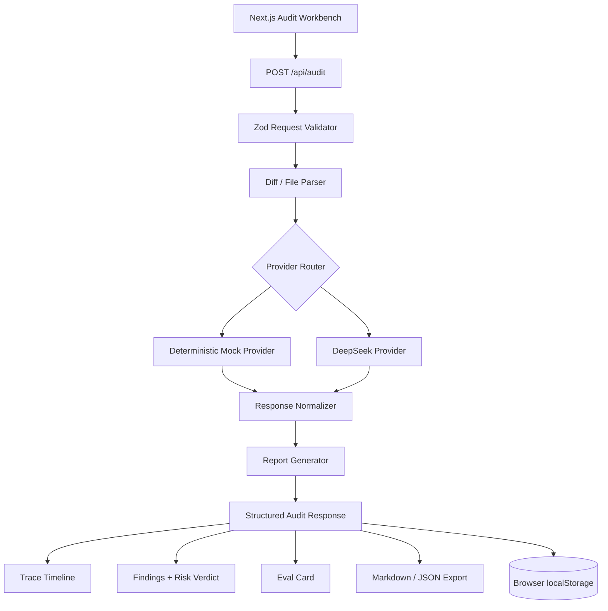

# HarnessLab：代码 Agent 审计工作台

[English README](./README.en.md)

HarnessLab 是一个面向代码审查场景的 AI Agent Harness 工作台。它可以把用户粘贴的 diff 或代码片段，转化为可观察的审计轨迹、结构化风险发现、风险评分、评估卡片和可导出的审查报告。

一句话来说：HarnessLab 不是普通 AI Chat UI，也不是简单的 DeepSeek 套壳，而是一个面向代码审查任务的 Agent Harness 产品壳。

## 产品预览



左侧控制输入和 Provider，中间展示完整 Harness Trace 与报告，右侧集中呈现风险结论、Findings 和 Eval Card。

## 项目定位

AI 应用正在从“直接调用模型”进入“Harness Engineering”阶段。单次模型回答并不够，真正有工程价值的是：

- 任务输入是否被正确解析
- Agent 是否有明确计划
- 检查过程是否可追踪
- 风险发现是否结构化
- 输出质量是否可以评估
- 审查结果是否方便导出和复用

HarnessLab 用代码审查这个具体场景，把这些能力做成一个可演示、可开源、可写进简历的产品界面。

## 核心功能

- 支持粘贴 unified diff 或 file snippet
- 支持输入类型切换：`diff` / `files`
- 支持 provider 切换：`mock` / `deepseek`
- 支持审查强度切换：`quick` / `standard`
- 展示完整 Harness Trace Timeline
- 输出结构化 findings
- 展示风险评分 Risk Score
- 展示 Eval Card：`reproducibility`、`traceability`、`testability`、`confidence`、`score`
- 支持导出 Markdown 审查报告
- 支持导出 JSON trace
- 最近审计 sessions 存入浏览器 localStorage
- 无 API Key 时，Mock Demo 也能完整演示
- 可部署到 Vercel

## 产品流程



## 系统架构



## 技术栈

- Next.js App Router
- TypeScript
- Tailwind CSS
- Zod
- lucide-react
- react-markdown
- Vitest
- Playwright
- Vercel

## 本地运行

```bash
npm install
npm run dev
```

打开：

```text
http://localhost:3000
```

默认选择 `Mock Demo` 即可完整体验，无需配置 API Key。

## 使用 DeepSeek

新建 `.env.local`：

```bash
DEEPSEEK_API_KEY=你的_key
DEEPSEEK_MODEL=deepseek-v4-flash
```

然后在页面 Provider 中选择 `DeepSeek`。

DeepSeek 调用只发生在服务端 `POST /api/audit`，浏览器不会拿到 API Key。

## 测试命令

```bash
npm test
npm run lint
npm run build
npx playwright test
```

当前测试覆盖：

- Zod schema 校验
- diff / file snippet 解析
- Mock Provider 启发式审计
- DeepSeek JSON fallback
- Markdown 报告生成
- API Route 成功和错误路径
- 桌面端和移动端 E2E 流程

## 为什么它不是普通套壳

普通 AI UI 往往只展示“用户输入”和“模型回答”。HarnessLab 展示的是 Agent 执行任务的全过程：

1. Input Intake：解析输入
2. Planning：生成审查计划
3. Inspection：执行检查
4. Finding Extraction：抽取结构化问题
5. Evaluation：评估审计过程质量
6. Report Generation：生成可导出报告

这种设计让模型审查过程从黑盒回答变成可观察、可评估、可复现的工程流程。

## 适合的求职叙事

这个项目可以这样写进简历或作品集：

> 基于 Harness Engineering 范式，独立设计并实现 HarnessLab 代码 Agent 审计工作台。项目支持 diff / file snippet 输入、Mock / DeepSeek provider 路由、结构化风险发现、审计 trace 可视化、质量评估卡片和 Markdown / JSON 导出，展示了从模型调用到可观测 Agent 产品化的完整工程链路。

可强调的技术点：

- AI Agent 产品界面设计
- OpenAI-compatible provider 接入
- 服务端 API Key 隔离
- Zod schema 约束模型输出
- Mock provider 可复现演示
- Eval Card 和 Trace Timeline 设计
- Next.js + Vercel 部署
- Vitest + Playwright 验证

## 部署到 Vercel

1. 将项目推送到 GitHub
2. 在 Vercel 中导入仓库
3. 可选配置环境变量：
   - `DEEPSEEK_API_KEY`
   - `DEEPSEEK_MODEL`
4. 部署后，Mock Demo 无需任何环境变量即可使用

## GitHub Topics 建议

```text
agent
harness-engineering
deepseek
code-review
ai-workbench
nextjs
vercel
```

## License

MIT
