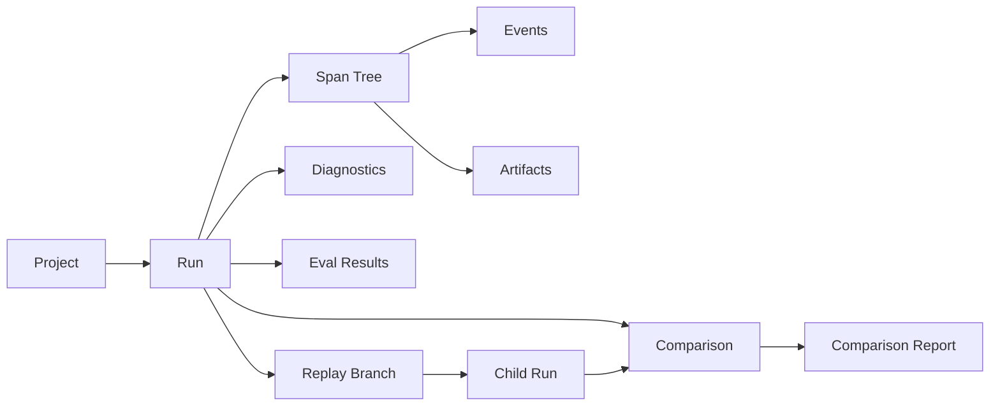
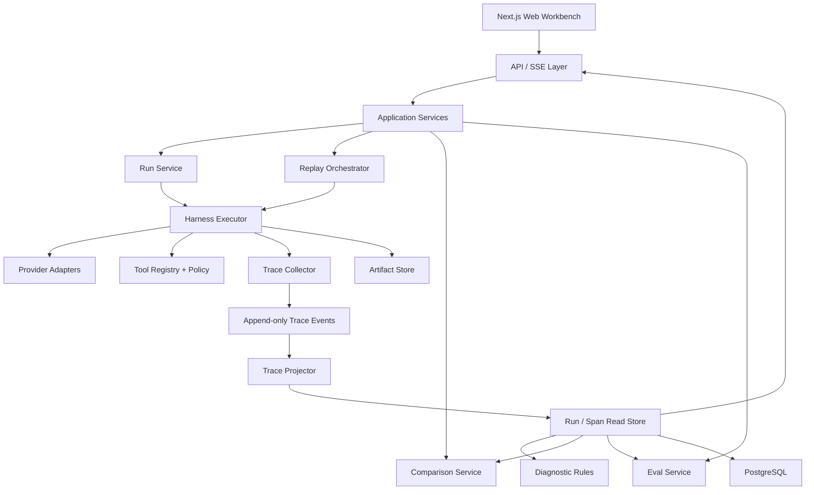

# AgentScope｜AI Agent 黑匣子回放器 PRD

> HarnessLab 扩展版：面向 AI Agent 的运行追踪、故障回放、分支重跑、结果比较与自动评测工作台

| 文档项 | 内容 |
| --- | --- |
| 文档版本 | v1.0 |
| 产品阶段 | 可进入设计与开发 |
| 目标版本 | AgentScope Showcase v1.0 |
| 主要读者 | 产品、设计、前端、后端、Agent 工程与评测工程 |
| 当前基础 | HarnessLab v0.2.0 |
| 最后更新 | 2026-07-28 |

---

## 1. 执行摘要

### 1.1 产品决策

AgentScope 值得作为 HarnessLab 的下一阶段，但不应被设计成“增加了更多指标的日志页面”，也不应在第一版尝试替代通用 APM、LangSmith 或 Langfuse。

AgentScope 的产品楔子是：

> 让开发者在 5 分钟内解释一次 Agent 为什么失败，从可安全重放的故障节点创建修复分支，并用同一套证据证明修复是否有效。

HarnessLab 负责 Agent 如何受约束地运行；AgentScope 负责一次运行如何被观察、解释、复现、比较和评估。二者共同形成从执行到改进的闭环。

### 1.2 最终产品形态

AgentScope Showcase v1.0 是一个本地优先、浏览器访问的开发者工作台，由四部分组成：

1. **Trace Explorer**：以树、时间轴和检查器呈现 Agent 的模型调用、工具调用、计划、输入输出、错误、延迟、Token 与产物。
2. **Replay Studio**：支持纯视觉回放，以及从可重放节点 Fork 新分支并重新执行。
3. **Run Compare**：对齐两次运行的执行路径、输出、错误、成本、延迟和评测结果。
4. **Eval Report**：用确定性规则为主、可选模型裁判为辅，自动生成带证据引用的运行质量报告。

产品仍保留无需 API Key 的确定性 Mock Demo；真实模型路径继续通过服务端 Provider Adapter 调用。

### 1.3 一句话价值

普通 Trace 工具告诉开发者“发生了什么”，AgentScope 还要帮助开发者回答：

- 为什么失败？
- 哪一步值得修改？
- 这一节点能否安全重跑？
- 修改后行为发生了什么变化？
- 修复是否真的让任务变好？

### 1.4 v1.0 交付成功画面

用户打开一条失败运行，看到时间轴上一个工具参数错误以及随后发生的三次重复调用；点击该节点，系统展示输入、输出、异常和上游上下文；用户修正参数或切换模型并执行 Fork；新分支完成后自动进入双运行比较；系统最后生成一份包含任务完成度、工具成功率、重复调用率、延迟、Token 和输出质量的 Eval 报告。

如果这条链路没有完整打通，即使页面上已有大量图表，也不算 AgentScope v1.0 完成。

---

## 2. 背景与机会

### 2.1 从第一性原理看 Agent 调试

传统软件的主要行为由确定性代码决定，错误通常可通过异常栈、日志和指标定位。Agent 的行为则同时受以下因素影响：

- 非确定性模型输出；
- Prompt、模型参数和上下文窗口；
- Agent 当前消息与状态；
- 工具定义、工具输入和外部系统返回；
- 重试、超时、并行调用和分支选择；
- 环境版本、数据版本和权限；
- 评测标准本身。

因此，仅保存最终回答无法解释过程，仅保存文本日志无法恢复结构，仅保存 Trace 又不等于可以重放。一个真正可用的 Agent 黑匣子至少需要：

1. 结构化记录一次运行；
2. 将记录还原为可理解的执行路径；
3. 区分“查看历史”和“重新执行”；
4. 在重跑前识别外部副作用；
5. 使用一致标准比较结果；
6. 给每个结论提供可回到原始步骤的证据。

### 2.2 当前 HarnessLab 的基础

HarnessLab v0.2.0 已提供：

- `intake → plan → inspect → finding → evaluate → report` 六阶段 SSE Trace；
- Provider、模型、耗时、Prompt 版本和 Token 记录；
- DeepSeek、MiniMax 与确定性 Mock Provider；
- 结构化 Finding 和确定性 Eval Card；
- Markdown 报告、JSON Trace 导出；
- 浏览器本地历史。

这些能力证明了 Harness 的边界，但当前数据模型仍存在五个关键限制：

| 当前限制 | 对 AgentScope 的影响 |
| --- | --- |
| Trace 只有六个固定阶段 | 无法表达模型循环、嵌套工具、并发和多 Agent |
| 同一阶段按 ID 覆盖更新 | 无法保存多次调用、重试和完整历史 |
| Provider 只返回最终结果 | 看不到模型输入输出、工具调用和中间状态 |
| 历史仅在 localStorage | 无法支持可靠分支、查询和评测关联 |
| Eval Card 与代码审计强绑定 | 无法成为通用 Agent 运行评测层 |

所以正确的实施顺序是先升级领域模型与持久化，再构建新的可视化；不能直接把现有 `TraceTimeline` 扩写成复杂页面。

### 2.3 行业基线与差异化

当前主流产品已经覆盖嵌套 Trace、模型与工具输入输出、Token、成本、实验和评测。AgentScope 不把“能显示 Trace”视为差异化，而把以下组合当作核心：

- **故障节点级 Fork**，保留原运行，形成可追溯分支；
- **副作用感知的安全重跑**，明确哪些工具可以真实执行；
- **行为差异比较**，不仅比较最终文本；
- **自动行为诊断**，识别重复调用、无效重试、循环和瓶颈；
- **证据化 Eval 报告**，每个结论可跳回对应 Span。

---

## 3. 产品目标与非目标

### 3.1 产品目标

AgentScope v1.0 必须实现以下目标：

| ID | 目标 | 可检查的成功标准 |
| --- | --- | --- |
| G1 | 解释一次运行 | 用户可查看每个模型/工具步骤的父子关系、输入输出、状态、耗时和 Token |
| G2 | 定位主要问题 | 系统能标出错误步骤、重复调用、异常重试、耗时热点和 Token 热点 |
| G3 | 安全地验证修复 | 用户可从允许重跑的节点 Fork，原运行不可被覆盖，危险工具默认不可真实重放 |
| G4 | 比较两个方案 | 用户可比较模型、Prompt、参数或节点输入变化造成的路径和结果差异 |
| G5 | 生成可信评测 | 报告区分事实指标、规则评分和模型裁判，并为结论提供 Span 证据 |
| G6 | 保持演示可复现 | 无 API Key 时仍能通过固定样例完整演示失败、Fork、比较和报告 |

### 3.2 产品非目标

v1.0 明确不做：

- 不记录或展示模型未显式输出的隐藏思维链；
- 不承诺任意第三方 Agent 框架均可零配置接入；
- 不做生产级全链路基础设施监控、告警和值班系统；
- 不做企业多租户、RBAC、SSO、计费和审计合规中心；
- 不自动执行真实写操作、发送消息、合并代码或修改线上数据；
- 不用一个总分替代开发者判断；
- 不在首版实现海量 Trace 的实时聚合分析；
- 不把 Prompt 管理、数据标注和完整 Dataset 平台纳入 v1.0。

### 3.3 关于“计划”的边界

“Agent 做了什么计划”只展示以下可审计信息：

- Agent 显式生成的 Plan；
- Harness 生成的执行计划；
- 任务清单、任务图、路由决策或 Handoff 事件；
- 模型实际发出的工具调用意图。

系统不得推断、伪造或宣称展示模型内部隐藏推理。UI 统一使用“显式计划”“决策摘要”或“执行步骤”，避免使用“读取模型思维”等误导性表达。

---

## 4. 用户与核心任务

### 4.1 目标用户

#### 用户 A：Agent 应用开发者

- 正在开发代码 Agent、研究 Agent、客服 Agent 或自动化工作流；
- 能读 JSON、日志和调用参数；
- 主要诉求是快速定位失败原因并验证修改。

核心任务：

> 当一次 Agent 结果异常时，我需要知道是哪一步以及什么上下文导致了问题，并在不重跑全部流程的情况下验证修改。

#### 用户 B：Agent 评测与质量工程师

- 管理回归样例、模型比较和 Prompt 版本；
- 关心完成度、稳定性、成本和退化；
- 需要可复现证据而不是主观印象。

核心任务：

> 当模型或 Prompt 变化时，我需要按一致标准比较两次运行，判断收益是否值得成本和稳定性代价。

#### 用户 C：技术负责人或面试评审者

- 不一定阅读所有原始 JSON；
- 关心系统边界、工程可靠性和指标解释；
- 需要在较短时间理解一次运行和产品能力。

核心任务：

> 我需要通过一条可演示、可追溯的链路理解这个 Agent Harness 如何观测、恢复和评测非确定性行为。

### 4.2 非目标用户

- 只想和聊天机器人对话的普通消费者；
- 只需要基础服务器 CPU、内存、日志监控的运维人员；
- 第一版即要求跨组织、多租户生产治理的大型企业平台团队。

---

## 5. 产品原则

1. **证据先于评分**：先展示原始事实，再给诊断和分数。
2. **历史不可变**：原 Trace、原输入输出和原评测结果不被重跑覆盖。
3. **重放不等于重执行**：视觉回放、固定响应模拟和真实重跑必须明确区分。
4. **默认安全**：外部写操作默认阻止，敏感字段默认脱敏。
5. **确定性优先**：可计算指标和规则优先于 LLM-as-a-Judge。
6. **失败也是完整结果**：即使 Agent 中断，已产生的 Trace 仍然可查看、导出和评测。
7. **先垂直后通用**：先把 HarnessLab 代码审计场景做深，再开放通用接入。
8. **简单架构优先**：v1.0 采用模块化单体与清晰接口，不提前拆微服务。

---

## 6. 产品信息架构

### 6.1 一级导航

| 页面 | 目的 | v1.0 |
| --- | --- | --- |
| Overview | 查看最近运行、失败趋势、演示入口 | 必须 |
| Runs | 搜索和筛选所有运行 | 必须 |
| Run Detail | 检查、回放和 Fork 单次运行 | 必须 |
| Compare | 比较两条运行或两个分支 | 必须 |
| Evals | 查看评测定义和报告历史 | 精简版 |
| Settings | Provider、数据保留与脱敏设置 | 精简版 |

### 6.2 Run Detail 布局

```text
--------------------------------------------------------------------------------+
| Run 名称 / 状态 / 模型 / 开始时间 | Replay | Fork from step | Compare | Export |
+----------------------+--------------------------------------+------------------+
| Trace Tree           | Timeline / Playback                  | Step Inspector   |
|                      |                                      |                  |
| > Agent Run          | 0s ----- model ----- tool ---- 18s  | Overview         |
|   > Plan             |        [error] [retry]               | Input / Output   |
|   > Model turn 1     |                                      | Error            |
|     > Tool: search   | Playback: |<  <  Play  >  >| 1x     | Metrics          |
|   > Model turn 2     |                                      | Raw JSON         |
|   > Final answer     |                                      | Replay safety    |
+----------------------+--------------------------------------+------------------+
| Diagnostics: 1 error · 1 retry chain · 3 duplicate calls · Token hotspot       |
+--------------------------------------------------------------------------------+
```

布局原则：

- 左侧回答“结构是什么”；
- 中间回答“何时发生、先后与并行关系是什么”；
- 右侧回答“这一步具体输入输出是什么”；
- 底部诊断回答“系统认为哪里值得关注”；
- 回放控制只改变查看进度，不触发外部调用；
- 真实重跑必须通过独立的 Fork 流程。

### 6.3 产品对象关系



---

## 7. 核心用户流程

### 7.1 流程 A：运行后定位失败

1. 用户发起代码审计 Agent 任务。
2. Overview 出现一条 `running` Run，Run Detail 实时追加 Span。
3. 工具调用失败，Run 最终为 `error` 或恢复后为 `success_with_warnings`。
4. 系统自动聚合错误链，并标记后续重复调用。
5. 用户点击诊断，定位到对应 Tool Span。
6. Inspector 展示工具名、参数、返回、异常、重试序号、父模型调用和相关产物。
7. 用户确认根因并进入 Fork。

成功标准：从打开失败 Run 到找到首个根因 Span，不超过 3 次点击。

### 7.2 流程 B：从失败节点 Fork

1. 用户点击“从此步骤 Fork”。
2. 系统执行 Replay Preflight：
   - 是否有可恢复上下文；
   - 上游工具输出是否完整；
   - 目标步骤是否可重新执行；
   - 下游是否包含副作用工具；
   - 模型、Prompt 和环境是否可用。
3. 用户可修改允许修改的参数，例如模型、温度、Prompt 版本或工具输入。
4. 系统列出本次将真实执行、使用历史固定响应或阻止的工具。
5. 用户确认后创建 Child Run；Parent Run 不发生变化。
6. Child Run 从已保存上下文继续，实时生成新 Span。
7. 执行结束后，系统自动打开 Parent 与 Child 的 Compare。

成功标准：任何真实重跑都必须先显示执行范围和副作用策略；失败重跑不会破坏原 Trace。

### 7.3 流程 C：比较两个模型

1. 用户从 Run 列表选择两个具有相同任务输入的运行。
2. Compare 页面显示配置差异：Provider、模型、Prompt、参数和环境指纹。
3. 系统按 Span 类型、名称、调用签名和相对顺序进行路径对齐。
4. 用户查看新增、删除、变更和未对齐步骤。
5. 页面展示任务完成度、错误、工具调用、重复率、延迟、Token、成本和评测差值。
6. 系统给出“事实摘要”，不在指标冲突时武断宣布唯一胜者。

成功标准：用户能明确回答“第二次运行改善了什么、退化了什么、代价是什么”。

### 7.4 流程 D：生成 Eval 报告

1. Run 完成或失败后自动运行确定性评测。
2. 如用户启用模型裁判，再异步运行带版本的 Judge。
3. 报告生成总体结论、指标、失败原因、证据和限制。
4. 每条诊断或评分解释可跳转到对应 Span。
5. 用户导出 Markdown 或 JSON。

成功标准：报告明确区分测量事实、规则推断、模型判断和无法判断的项目。

---

## 8. 功能需求

优先级说明：

- **P0**：AgentScope Showcase v1.0 缺少此项即不完成；
- **P1**：v1.x 增强，不阻塞核心闭环；
- **P2**：后续产品化方向。

### 8.1 Run 创建与实时状态

#### FR-RUN-01 创建运行（P0）

用户可以：

- 选择内置审计样例、粘贴 diff/file snippet 或导入公开 GitHub PR；
- 选择 Provider、模型、执行强度和审查规则；
- 为 Run 添加名称与标签；
- 启动 Mock 或真实 Provider。

系统必须记录：

- 原始请求摘要与内容哈希；
- Agent/Harness 版本；
- Provider、模型和模型参数；
- Prompt 版本；
- 工具清单及版本；
- 运行环境指纹；
- 创建时间、开始时间和结束时间。

验收标准：

- 创建成功后立即获得稳定 `runId`；
- 页面刷新后仍能恢复 Run；
- 相同输入可以产生多个独立 Run，不能按输入哈希覆盖。

#### FR-RUN-02 状态机（P0）

Run 状态：

```text
queued → running → success
                 ↘ success_with_warnings
                 ↘ error
                 ↘ cancelled
```

验收标准：

- 状态只能按允许的方向变化；
- 进程异常退出时，未闭合 Run 在恢复扫描后标记为 `error`，原因是 `runner_interrupted`；
- 失败 Run 保留已上报的全部 Span。

#### FR-RUN-03 实时更新（P0）

- 前端通过 SSE 接收增量事件；
- 断线重连使用最后事件序号补发，不重复创建 Span；
- 结束事件到达后展示汇总指标。

验收标准：

- 本地环境中事件产生后 300ms 内出现在 UI；
- 刷新页面后不会丢失已持久化事件；
- 重复事件通过 `eventId` 幂等处理。

### 8.2 Trace 采集

#### FR-TRACE-01 任意嵌套 Span（P0）

Span 类型至少支持：

- `agent`：Agent 或子 Agent 执行；
- `plan`：显式计划；
- `model`：模型生成；
- `tool`：工具执行；
- `handoff`：Agent 交接；
- `guardrail`：安全或约束检查；
- `eval`：评测执行；
- `custom`：业务自定义步骤。

每个 Span 必须包含：

- `spanId`、`runId`、可选 `parentSpanId`；
- 类型、名称、状态和序号；
- 开始与结束时间；
- 输入、输出的引用或脱敏摘要；
- 错误；
- 属性和标签；
- 可选 Token、成本与 Provider 指标。

验收标准：

- 同一父节点下可保存同类 Span 多次调用；
- 不再使用固定阶段 ID 覆盖历史；
- 串行、嵌套与并发步骤可被正确表达。

#### FR-TRACE-02 模型调用记录（P0）

模型 Span 记录：

- Provider、请求模型、实际响应模型；
- 显式 system/user/assistant/tool messages；
- 模型参数；
- 输入、输出、缓存和推理 Token（Provider 提供时）；
- 首 Token 延迟、总延迟和结束原因（Provider 提供时）；
- Tool Call 请求；
- 请求 ID 与错误类型。

验收标准：

- Provider 不返回某字段时显示“未提供”，不能估算后伪装成真实值；
- 敏感内容关闭采集后，仅保存哈希、长度和结构摘要；
- 不展示隐藏思维链。

#### FR-TRACE-03 工具调用记录（P0）

工具 Span 记录：

- 工具名、版本、调用 ID；
- 结构化参数与结果；
- 开始、结束、耗时；
- 状态、异常和重试关联；
- 副作用等级；
- 输出产物引用。

验收标准：

- 参数和结果可按树形 JSON、原始 JSON 和文本三种适用方式查看；
- 单个大对象不会阻塞主 Trace 加载；
- 工具异常与模型 API 异常使用不同错误类型。

#### FR-TRACE-04 Artifact（P0）

Artifact 用于保存报告、diff、文件片段、截图或较大工具结果。

验收标准：

- Span 只保存 Artifact 元数据和引用；
- Artifact 有内容哈希、媒体类型、字节数和脱敏状态；
- 丢失 Artifact 时 Trace 仍可加载，并明确显示不可用。

#### FR-TRACE-05 通用接入（P1）

- 提供轻量 TypeScript Instrumentation API；
- 支持 AgentScope JSON Trace 导入；
- 预留 OpenTelemetry GenAI Span 映射适配器。

v1.0 只要求 HarnessLab 原生接入和 JSON 导入导出，不能因追求全框架自动埋点而推迟核心闭环。

### 8.3 Trace Explorer 与时间轴回放

#### FR-EXPLORE-01 Trace Tree（P0）

- 展示父子层级、类型、状态、名称和耗时；
- 支持展开/收起；
- 支持按模型、工具、错误、状态和文本过滤；
- 错误祖先节点显示聚合标记；
- 当前选中 Span 与时间轴同步高亮。

验收标准：

- 1,000 个 Span 的样例下仍可流畅展开和选择；
- 筛选后保留必要祖先路径；
- 键盘可完成上下移动、展开、收起和选择。

#### FR-EXPLORE-02 Timeline（P0）

- 按相对时间展示 Span；
- 并行 Span 使用不同泳道；
- 颜色表达类型，图标和文本表达状态，不能只依赖颜色；
- 支持缩放、拖动和“适应全部”；
- 显示关键错误、重试和 Fork 点。

验收标准：

- 时间宽度由真实时间计算；
- 未闭合 Span 使用进行中样式；
- 极短 Span 仍有可点击最小宽度，但 Tooltip 显示真实耗时。

#### FR-EXPLORE-03 视觉回放（P0）

回放控制：

- 回到开始；
- 上一步/下一步；
- 播放/暂停；
- 0.5x、1x、2x；
- 拖动到任意时间；
- 只看关键步骤。

视觉回放只改变 UI 可见进度，不产生模型或工具请求。

验收标准：

- 用户无需确认即可任意视觉回放；
- 播放到错误节点时自动暂停可配置；
- 当前时间点只高亮当时已开始的 Span。

#### FR-EXPLORE-04 Step Inspector（P0）

Inspector 标签：

- Overview；
- Input；
- Output；
- Error；
- Metrics；
- Raw；
- Replay Safety。

验收标准：

- 诊断、比较和报告中的 Span 链接都能打开相同 Inspector；
- JSON 支持折叠、复制和字段级 Diff；
- 已脱敏字段以明确占位符展示。

### 8.4 自动诊断

#### FR-DIAG-01 错误链（P0）

系统区分：

- `model_error`；
- `tool_error`；
- `validation_error`；
- `timeout`；
- `rate_limit`；
- `cancelled`；
- `runner_interrupted`；
- `unknown_error`。

诊断从最早未被成功恢复的错误开始，关联其后续重试和最终影响。

验收标准：

- “根因”必须附带算法解释和证据 Span；
- 如果只能确认相关性，UI 使用“可能起点”而非“根因”；
- 已成功恢复的错误不会自动把整个 Run 判定为失败。

#### FR-DIAG-02 重复与循环检测（P0）

定义：

- **精确重复**：相同工具名与规范化参数哈希重复出现；
- **有效重试**：前一次失败，后一次有明确参数或上下文变化；
- **无效重试**：失败后以相同输入重复且结果相同；
- **疑似循环**：相似调用序列重复出现，且没有可观测状态进展。

默认规则：

- 同一 Run 中，同一调用签名出现 2 次标记重复；
- 连续出现 3 次且结果签名一致，标记疑似循环；
- 有 Harness 显式 retry 元数据时优先采用元数据，而不是仅靠启发式。

验收标准：

- 规范化参数时对象键排序、忽略配置中的允许字段；
- 用户可查看匹配的全部 Span；
- 用户可以将诊断标记为误报，但不修改原始 Span。

#### FR-DIAG-03 性能与成本热点（P0）

系统标记：

- 最慢模型调用；
- 最慢工具调用；
- 占 Run 总耗时比例最高的关键路径；
- Token 消耗最高的模型 Span；
- 重复调用造成的可归因额外消耗。

验收标准：

- 并行 Span 不能简单相加后当作总耗时；
- Token 未提供时不生成 Token 排名；
- 成本必须注明价格表版本和币种，v1.0 可只展示 Token。

#### FR-DIAG-04 诊断可扩展（P1）

诊断器使用统一接口：

```ts
type DiagnosticRule = {
  id: string;
  version: string;
  analyze(run: RunProjection): Diagnostic[];
};
```

首版规则保持纯函数，可基于固定 Trace Fixture 进行确定性测试。

### 8.5 Replay Studio 与分支重跑

#### FR-REPLAY-01 三种重放语义（P0）

产品必须明确区分：

| 模式 | 是否调用模型 | 是否调用工具 | 用途 |
| --- | --- | --- | --- |
| Visual Replay | 否 | 否 | 理解历史过程 |
| Fixture Replay | 可选固定响应 | 使用历史结果 | 验证编排和 UI，可复现 Demo |
| Fork Re-run | 是 | 依安全策略 | 验证模型、Prompt 或输入修改 |

UI 中不得把 Fixture Replay 或 Fork Re-run 宣称为“完全复现原环境”。

#### FR-REPLAY-02 Replay Checkpoint（P0）

Harness 在以下边界保存可恢复上下文：

- 每个模型 Turn 之前；
- 每个工具调用之前；
- 显式计划完成后；
- Handoff 前后；
- 最终结果生成前。

Checkpoint 至少包含：

- 消息历史或其可恢复引用；
- Agent 当前结构化状态；
- Prompt 与工具定义版本；
- 已批准复用的上游工具结果；
- Provider 配置；
- 环境指纹；
- Checkpoint Schema 版本。

验收标准：

- 没有完整 Checkpoint 的 Span 不显示“可从此处重跑”；
- Checkpoint 与原 Run 不可变绑定；
- 内容被脱敏或未采集导致不可恢复时明确标记原因。

#### FR-REPLAY-03 工具副作用策略（P0）

每个工具在注册时声明：

```text
read_only      只读，可默认真实重跑
idempotent     写操作但有幂等键，需用户确认
side_effect    可能产生外部副作用，默认使用历史结果
destructive    难恢复操作，v1.0 禁止真实重跑
unknown        未声明，按 side_effect 处理
```

v1.0 默认策略：

- `read_only`：允许真实执行；
- `idempotent`：展示幂等键后要求确认；
- `side_effect`：只能使用历史 Fixture 或跳过；
- `destructive`：阻止；
- `unknown`：阻止真实执行。

验收标准：

- Preflight 必须列出所有下游工具及处理方式；
- 用户不能通过普通 UI 绕过 `destructive` 限制；
- 工具策略变化需要版本化并记录在新 Run。

#### FR-REPLAY-04 创建分支（P0）

用户可以修改：

- 模型或 Provider；
- 模型参数；
- Prompt 版本或显式附加指令；
- 目标工具的参数；
- Replay Policy。

系统创建：

- 新 `runId`；
- `parentRunId`；
- `forkedFromSpanId`；
- 配置差异；
- 复制的上游 Span 引用；
- 新执行的下游 Span。

验收标准：

- 原 Run 与 Span 永不修改；
- Fork 失败也保留 Child Run 和错误；
- 分支图可从任一 Child 回到根 Run；
- 同一节点可产生多个 Child。

#### FR-REPLAY-05 可复现性等级（P0）

每次 Fork 前显示：

- `high`：模型/工具使用固定 Fixture，环境和输入完整；
- `medium`：真实模型或只读外部工具会重新调用；
- `low`：外部数据可能变化，或存在缺失上下文；
- `blocked`：缺失关键 Checkpoint 或包含禁止工具。

等级是系统根据证据计算的可复现性声明，不等同于结果质量评分。

### 8.6 Run Compare

#### FR-COMPARE-01 选择与兼容性（P0）

允许比较任意两个 Run，但分为：

- 同任务比较：`taskInputHash` 相同；
- 分支比较：共享祖先 Run；
- 异源比较：输入不同，显示明显警告。

验收标准：

- 默认推荐同任务或同祖先运行；
- 输入不同不计算“相对任务改进”结论；
- 配置差异在页面首屏可见。

#### FR-COMPARE-02 路径对齐（P0）

对齐优先级：

1. 共享 Span 引用；
2. 稳定业务键；
3. Span 类型 + 名称 + 调用签名；
4. 父节点匹配 + 相对顺序；
5. 未匹配。

结果状态：

- unchanged；
- changed；
- added；
- removed；
- unmatched。

验收标准：

- 自动对齐结果可解释；
- 不确定匹配必须标记置信度；
- 未匹配步骤不被强行并排。

#### FR-COMPARE-03 指标比较（P0）

至少比较：

- 最终状态；
- 任务完成度；
- 总耗时与首 Token 延迟；
- 模型调用次数；
- 工具调用次数与成功率；
- 错误与恢复次数；
- 精确重复和疑似循环次数；
- 输入、输出与总 Token；
- Eval 各维度分数；
- 最终输出文本或结构化 Diff。

验收标准：

- 同时显示绝对值与差值；
- “越高越好”和“越低越好”的指标方向正确；
- 缺失值显示 N/A，不按 0 计算；
- 不把速度、成本和质量合成不可解释的单一胜负。

#### FR-COMPARE-04 比较摘要（P0）

系统按规则生成事实摘要，例如：

- “Child Run 完成任务，Parent Run 在工具调用阶段失败”；
- “总 Token 降低 18%，但总耗时增加 12%”；
- “重复工具调用由 3 次降为 0 次”。

可选模型摘要必须标记为 AI 生成，且只能引用已有指标和证据。

### 8.7 Eval 与报告

#### FR-EVAL-01 评测层级（P0）

评测分四层：

1. **Execution Facts**：状态、耗时、Token、调用次数等事实；
2. **Deterministic Checks**：Schema、工具成功率、重复率、必经步骤、输出非空；
3. **Task-specific Checks**：例如代码审计 Finding 是否包含证据和建议；
4. **Model Judge**：按明确 Rubric 评估主观质量，可选。

验收标准：

- 每项结果记录 evaluator ID 和版本；
- 模型裁判记录 Judge Provider、模型、Prompt 版本、Token 与解释；
- 模型裁判失败不影响事实和确定性报告生成。

#### FR-EVAL-02 v1.0 默认指标（P0）

| 指标 | 计算原则 |
| --- | --- |
| Task completion | Harness 明确完成信号 + 必需输出校验 |
| Tool success rate | 成功 Tool Span / 已结束 Tool Span |
| Error recovery | 失败后是否存在成功替代步骤并最终完成 |
| Duplicate call rate | 精确重复 Tool Span / 全部 Tool Span |
| Loop risk | 是否触发疑似循环规则 |
| Trace completeness | Span 闭合率、父子引用与关键字段完整率 |
| Output validity | 最终输出是否符合任务 Schema |
| Latency | Run 墙钟耗时及关键路径 |
| Token usage | Provider 实际返回值汇总 |
| Reproducibility | Checkpoint、Fixture、版本与环境信息完备度 |

旧版 Eval Card 中的可追溯性、可测试性等维度可作为任务专项指标迁移，但不再与通用 Run 模型耦合。

#### FR-EVAL-03 结论等级（P0）

单项评测使用：

- `pass`；
- `warn`；
- `fail`；
- `not_applicable`；
- `unknown`。

总报告可以给出 `healthy`、`needs_attention` 或 `failed`，但必须同时显示关键理由。不得只显示一个 0–100 总分。

#### FR-EVAL-04 自动报告（P0）

报告包含：

1. Run 摘要与配置；
2. 最终结果和任务完成状态；
3. 执行路径摘要；
4. 错误与恢复；
5. 重复调用与循环；
6. 延迟与 Token；
7. Eval 结果及证据；
8. 可复现性说明；
9. 限制和缺失数据；
10. 如为比较报告，增加关键变化。

格式：

- 页面内报告；
- Markdown 导出；
- JSON 导出。

验收标准：

- 报告中的每个错误和诊断带 `runId + spanId`；
- 导出 JSON 通过版本化 Schema 校验；
- Markdown 不包含未脱敏敏感值。

### 8.8 Run 管理

#### FR-MANAGE-01 Run 列表（P0）

- 按状态、Provider、模型、时间、标签和是否存在错误筛选；
- 按时间、耗时、Token 排序；
- 显示分支关系；
- 支持打开、比较和导出。

#### FR-MANAGE-02 删除与保留（P1）

- 用户可按 Run 删除；
- 删除有 Child 的 Parent 时默认阻止，并解释引用关系；
- 数据保留策略按天或数量配置；
- 删除 Artifact 与元数据采用一致生命周期。

v1.0 只需提供开发环境中的明确清理命令，不在核心 UI 暴露复杂生命周期管理。

#### FR-MANAGE-03 Demo Fixtures（P0）

至少提供三条稳定样例：

1. 成功代码审计；
2. 工具失败并发生无效重复；
3. 从失败节点 Fork 后成功，并可与 Parent 比较。

验收标准：

- 无 API Key、无外部网络时完整可用；
- Fixture 包含固定时间与 Token，截图和 E2E 测试稳定；
- Mock 不冒充真实模型。

---

## 9. 数据模型

### 9.1 核心实体

#### Project

| 字段 | 说明 |
| --- | --- |
| id | 稳定 ID |
| name | 项目名 |
| createdAt | 创建时间 |
| settings | 脱敏、保留和默认评测配置 |

#### Run

| 字段 | 说明 |
| --- | --- |
| id | 运行 ID |
| projectId | 所属项目 |
| name | 显示名称 |
| status | Run 状态 |
| taskType | 首版为 `code_audit`，允许扩展 |
| taskInputHash | 规范化任务输入哈希 |
| provider/model | 主模型信息 |
| configSnapshot | 不可变运行配置 |
| environmentFingerprint | 代码、Prompt、工具和环境版本摘要 |
| rootSpanId | 根 Span |
| parentRunId | 可选，分支父 Run |
| forkedFromSpanId | 可选，Fork 点 |
| startedAt/completedAt | 运行时间 |
| schemaVersion | Run Schema 版本 |

#### Span

| 字段 | 说明 |
| --- | --- |
| id | Span ID |
| runId | 所属 Run |
| parentSpanId | 父 Span |
| kind | agent/plan/model/tool/handoff/guardrail/eval/custom |
| name | 稳定、低基数名称 |
| status | running/success/error/cancelled/skipped |
| sequence | Run 内单调序号 |
| startedAt/endedAt | 时间 |
| inputRef/outputRef | Payload 或 Artifact 引用 |
| attributes | 结构化扩展属性 |
| error | 结构化异常 |
| metrics | Span 指标 |
| replayability | 重跑能力与原因 |

#### TraceEvent

TraceEvent 是追加写入的事实，用于实时流和审计；Span 是基于事件构建的读取投影。

| 字段 | 说明 |
| --- | --- |
| eventId | 幂等 ID |
| runId/spanId | 关联对象 |
| sequence | Run 内单调递增序号 |
| type | run.started/span.started/span.ended/artifact.created 等 |
| occurredAt | 发生时间 |
| receivedAt | 服务端接收时间 |
| payload | 版本化事件内容 |
| schemaVersion | 事件版本 |

#### Artifact

| 字段 | 说明 |
| --- | --- |
| id | Artifact ID |
| runId/spanId | 来源 |
| kind | report/diff/file/json/text/image |
| mediaType | MIME |
| storageKey | 存储引用 |
| contentHash | 完整性校验 |
| sizeBytes | 大小 |
| redactionState | 未扫描/已脱敏/阻止 |

#### ReplayCheckpoint

| 字段 | 说明 |
| --- | --- |
| id | Checkpoint ID |
| runId/spanId | 对应边界 |
| stateRef | 可恢复状态 |
| configSnapshot | 执行配置 |
| toolPolicySnapshot | 工具策略 |
| completeness | 完整度 |
| blockedReasons | 不可重跑原因 |
| schemaVersion | 版本 |

#### Diagnostic

| 字段 | 说明 |
| --- | --- |
| id | 诊断 ID |
| ruleId/ruleVersion | 规则与版本 |
| severity | info/warning/error |
| category | error/retry/loop/latency/token/data_quality |
| title/explanation | 结论与解释 |
| evidenceSpanIds | 证据 |
| confidence | 规则置信度 |
| feedback | 用户误报反馈，不修改原 Trace |

#### EvalDefinition / EvalResult

评测定义与结果分离。定义可版本化，结果不可变并绑定 Run、Span、Evaluator 版本和证据。

### 9.2 事件而非可变日志

采用“追加事件 + 读取投影”的原因：

- 保留同一 Span 的开始、更新、结束与异常历史；
- 支持 SSE 断线补发和幂等；
- 失败进程留下的半成品仍可恢复；
- 分支只引用上游历史，不需要复制并修改原数据；
- 诊断和 Eval 可以基于同一事实重新计算；
- 后续可导出为 OpenTelemetry 或其他格式。

不需要在 v1.0 建设通用事件溯源框架。事件类型保持有限，投影逻辑集中并有测试。

### 9.3 Payload 策略

- 小于阈值的结构化数据可存数据库 JSON；
- 大 Payload 和二进制内容存 Artifact Store；
- 数据库只保存引用、摘要、哈希和脱敏状态；
- 默认阈值建议 32KB，可配置；
- Payload 采集前执行字段名规则和内容规则脱敏；
- 原始敏感值不先落盘再异步脱敏。

---

## 10. 系统架构

### 10.1 架构原则

1. **模块化单体优先**：当前规模不需要微服务。
2. **领域接口隔离外部实现**：Provider、存储、Artifact 和工具执行通过接口替换。
3. **写模型和读模型分离但不分布式化**：事件追加与 Trace Projection 逻辑分开。
4. **执行与展示解耦**：UI 不直接调用 Provider 或工具。
5. **所有重跑创建新 Run**：架构上禁止原地修改历史。
6. **Schema 先行**：事件、导出和 API 都有版本。
7. **渐进兼容 OTel**：内部语义稳定，外部标准通过 Adapter 映射，避免被尚在演进的 GenAI 语义约定绑死。

### 10.2 目标逻辑架构



### 10.3 部署形态

#### v1.0 Showcase

- 一个 Next.js 应用进程；
- Harness Executor 通过应用层接口在同一 Node.js 运行时执行；
- PostgreSQL 保存 Run、Span、事件、诊断与 Eval；
- 本地文件系统保存开发环境 Artifact；
- SSE 提供实时更新；
- Docker Compose 提供一条命令启动数据库；
- Mock Fixture 路径无需真实 Provider Key。

#### 后续规模化触发条件

只有满足以下任一条件时再拆独立 Worker：

- 单次 Run 经常超过平台请求时限；
- 同时运行任务超过 5 个；
- 需要任务优先级、暂停、恢复或跨机器执行；
- API 进程重启导致 Run 中断不可接受。

拆分后，`RunExecutor` 接口保持不变，通过数据库 Job/消息队列调度。v1.0 不提前引入 Kafka、Redis Cluster 或复杂工作流引擎。

### 10.4 模块边界

建议目录按职责演进：

```text
app/
  runs/                         页面与路由
  compare/
  evals/
  api/v1/

components/agentscope/
  trace-tree/
  timeline/
  inspector/
  replay/
  compare/
  eval-report/

lib/agentscope/
  domain/                       纯类型、状态机、领域规则
    run/
    trace/
    replay/
    eval/
  application/                  用例编排
    create-run.ts
    append-trace-event.ts
    fork-run.ts
    compare-runs.ts
    evaluate-run.ts
  infrastructure/               外部实现
    db/
    artifacts/
    providers/
    streaming/
  instrumentation/              Harness 埋点与导入导出
  diagnostics/                  纯函数诊断规则

tests/
  fixtures/traces/
  domain/
  application/
  api/
e2e/
```

约束：

- React 组件不直接访问数据库；
- Provider 不生成 Eval 或 UI Event；
- 诊断器不发起外部写操作；
- Domain 不依赖 Next.js、React 或具体数据库；
- 不创建一个同时处理执行、持久化、SSE 和评测的超大 Orchestrator 文件。

### 10.5 关键接口

```ts
interface TraceEventRepository {
  append(event: TraceEvent): Promise<void>;
  listAfter(runId: string, sequence: number): Promise<TraceEvent[]>;
}

interface RunRepository {
  create(run: Run): Promise<void>;
  get(runId: string): Promise<Run | null>;
  updateStatus(command: RunStatusCommand): Promise<void>;
}

interface ArtifactStore {
  put(input: ArtifactInput): Promise<ArtifactRef>;
  get(ref: ArtifactRef): Promise<ReadableStream>;
}

interface RunExecutor {
  execute(command: ExecuteRunCommand): AsyncIterable<ExecutionEvent>;
}

interface ToolDefinition<TInput, TOutput> {
  name: string;
  version: string;
  sideEffect: ToolSideEffect;
  inputSchema: unknown;
  execute(input: TInput, context: ToolContext): Promise<TOutput>;
}
```

接口数量以实际替换点为依据，不为每个函数机械创建接口。

### 10.6 API 草案

```text
POST   /api/v1/runs
GET    /api/v1/runs
GET    /api/v1/runs/:runId
GET    /api/v1/runs/:runId/events?after={sequence}
GET    /api/v1/runs/:runId/stream
POST   /api/v1/runs/:runId/cancel

POST   /api/v1/runs/:runId/replay-preflight
POST   /api/v1/runs/:runId/forks

POST   /api/v1/comparisons
GET    /api/v1/comparisons/:comparisonId

POST   /api/v1/runs/:runId/evaluations
GET    /api/v1/runs/:runId/report

GET    /api/v1/artifacts/:artifactId
POST   /api/v1/import/trace
GET    /api/v1/runs/:runId/export
```

API 规则：

- 写请求使用 Zod 校验；
- 错误返回稳定 `code`，不依赖文案判断；
- Fork 请求支持幂等键；
- Artifact 下载检查所属 Project；
- SSE 事件包含 `eventId`、`sequence` 和 `schemaVersion`。

---

## 11. 关键算法

### 11.1 调用签名

用于精确重复检测：

```text
signature = hash(
  tool.name
  + tool.version
  + canonicalJson(arguments, ignoredPaths)
)
```

`canonicalJson` 必须：

- 对对象键排序；
- 保留数组顺序；
- 统一数字和空值表达；
- 按工具配置忽略时间戳、requestId 等非语义字段；
- 在哈希前使用脱敏后的值。

结果签名使用同样方式计算，但错误栈只保留稳定错误类型和消息摘要。

### 11.2 疑似循环

首版采用可解释的规则，不引入向量数据库：

1. 将连续 Tool Span 转为调用签名序列；
2. 检查长度为 1–4 的子序列是否重复至少 3 次；
3. 检查重复期间是否有新的成功 Artifact、状态字段变化或最终进展；
4. 如果没有进展，生成 `loop_suspected`；
5. 输出匹配窗口、重复次数和排除规则。

后续可增加参数相似度，但不能用不可解释的模型判断替代确定性检测。

### 11.3 路径对齐

比较时先锁定共享上游 Span，再在每个父节点内执行局部对齐，避免全局序列误配。

对齐分值参考：

```text
sharedReference       100
stableBusinessKey      90
sameKindNameSignature  80
sameKindName           60
sameKindAndPosition    40
```

低于阈值保持未对齐。对齐算法必须输出匹配依据，而不是只输出结果。

### 11.4 关键路径耗时

- 构建 Span 父子 DAG；
- 每个节点使用自身独占时间，避免父子耗时重复计算；
- 并发兄弟节点按最长路径计入墙钟关键路径；
- 异常时间戳回退到服务端接收时间并标记数据质量警告。

---

## 12. 安全、隐私与可信度

### 12.1 数据分级

| 数据 | 默认策略 |
| --- | --- |
| API Key、Authorization、Cookie | 永不采集 |
| Prompt/模型输入输出 | 本地开发可配置，默认脱敏敏感字段 |
| Tool 参数与结果 | 按工具 Schema 标记敏感路径 |
| 文件内容与 Diff | 允许采集，但报告导出前再次扫描 |
| 二进制 Artifact | 默认不内联 |
| 隐藏思维链 | 不采集、不推断 |

### 12.2 脱敏

- 在持久化前执行；
- 字段名规则覆盖 token、secret、password、authorization、cookie、apiKey；
- 工具可声明 JSON Path 级敏感字段；
- 文本规则覆盖常见密钥模式；
- 脱敏记录保存规则版本；
- UI 复制和导出使用同一脱敏投影。

### 12.3 重跑安全

- 工具副作用是服务端强制策略，不只是前端提示；
- `destructive` 工具 v1.0 无真实重跑入口；
- `idempotent` 工具必须有稳定幂等键；
- Fixture Replay 中的历史结果带明显标识；
- Fork 创建人、配置和确认动作写入不可变元数据。

### 12.4 可信表达

系统中的结论使用四种标签：

- `Measured`：直接测量；
- `Derived`：确定性计算；
- `Heuristic`：启发式诊断；
- `AI-judged`：模型裁判。

用户应能看到结论类型、算法/Prompt 版本和证据。任何模型生成解释都不能覆盖原始事实。

---

## 13. 非功能需求

### 13.1 性能

| 指标 | v1.0 目标 |
| --- | --- |
| Trace 采集额外开销 | 本地 P95 小于 20ms/事件，不含 Payload 上传 |
| 实时 UI 延迟 | P95 小于 300ms |
| Run Detail 首屏 | 1,000 Span、无大 Artifact 时小于 2s |
| Timeline 交互 | 主流开发机保持可感知流畅 |
| 单 Run 默认上限 | 10,000 Span，超限明确警告 |
| 内联 Payload | 默认不超过 32KB |

### 13.2 可靠性

- 事件写入幂等；
- Span 开始后即持久化；
- Run 失败不丢失已完成事件；
- SSE 断线可按序号恢复；
- 导出包含 Schema 版本；
- 数据库迁移可前滚且有回滚说明。

### 13.3 可访问性

- 错误、状态和类型不只使用颜色；
- 主要 Trace 操作支持键盘；
- Inspector 标签和回放控制有可读名称；
- 颜色对比满足 WCAG AA；
- 动画遵循 `prefers-reduced-motion`。

### 13.4 可观测性自举

AgentScope 自身至少记录：

- Run 创建和完成数量；
- Trace 事件写入失败；
- SSE 重连次数；
- Replay Preflight 拒绝原因；
- Fork 成功率；
- Eval 失败；
- API 延迟和结构化错误。

不允许 AgentScope 的内部遥测再次无限产生 AgentScope Trace。

---

## 14. 产品指标

### 14.1 北极星指标

**可验证修复率**：

> 失败 Run 中，用户从诊断证据进入 Fork，且 Child Run 的目标失败消失并完成比较报告的比例。

该指标同时要求观察、行动和验证，优于单纯页面访问量或 Trace 数量。

### 14.2 核心指标

| 类型 | 指标 |
| --- | --- |
| 激活 | 首次进入后 10 分钟内完成一次 Demo Run 并打开错误 Span |
| 定位效率 | 打开失败 Run 到选择首个相关 Span 的时间 |
| 闭环 | 失败 Run → Fork → Compare → Report 的完成率 |
| 诊断质量 | 重复调用检测 Fixture 的 Precision/Recall |
| 安全 | 被 Preflight 阻止的危险真实重跑全部为 100% 服务端阻止 |
| 稳定性 | Trace 事件丢失率、未闭合 Span 比例 |
| 可复现 | Mock 分支 E2E 连续运行结果一致率 |

### 14.3 v1.0 验收阈值

- 三条 Demo Fixture 全部通过 E2E；
- 重复/循环规则在固定评测集上 Precision ≥ 90%，Recall ≥ 80%；
- 所有报告诊断可跳转到证据 Span；
- 禁止级工具真实重跑测试 100% 被阻止；
- 1,000 Span Fixture 的详情页达到性能目标；
- 无 Key 环境可完成完整核心演示；
- typecheck、lint、unit、eval、build 和 e2e 全部通过。

---

## 15. 实施路线

以下估算按一名熟悉现有代码库的开发者计算，是范围控制参考，不是交付承诺。

### Phase 0：领域模型与技术决策（2–3 天）

交付：

- Run、Span、TraceEvent、Artifact、Checkpoint Schema；
- Run/Span 状态机；
- 工具副作用枚举；
- 三份完整 JSON Trace Fixture；
- 关键 ADR：事件模型、持久化、重跑语义、敏感数据策略。

完成标准：

- Fixture 通过 Zod Schema；
- 能表达重复工具、嵌套调用、错误恢复和分支；
- 团队对“视觉回放”和“真实重跑”没有语义歧义。

### Phase 1：Trace Foundation（1–1.5 周）

交付：

- PostgreSQL Schema 与 Repository；
- Append-only Trace Event；
- Span Projection；
- HarnessLab 六阶段事件迁移为通用 Span；
- SSE 断线续传；
- Run 列表和详情基础 API。

完成标准：

- 现有代码审计流程行为不退化；
- 同一工具多次调用不覆盖；
- 中途异常后已写 Trace 可恢复；
- localStorage 只保留 UI 偏好，不再作为运行事实源。

### Phase 2：Trace Explorer（1–1.5 周）

交付：

- Trace Tree；
- Timeline；
- Step Inspector；
- 视觉回放；
- 过滤与错误定位；
- Artifact 查看。

完成标准：

- 三条 Fixture 均可完整查看；
- 1,000 Span 性能达标；
- 视觉回放不会发起任何 Provider 或 Tool 请求。

### Phase 3：Diagnostics 与 Replay（1.5–2 周）

交付：

- 错误链、重复调用、循环和热点诊断；
- Checkpoint；
- Replay Preflight；
- Tool Policy；
- Fixture Replay；
- Fork Re-run 与分支图。

完成标准：

- 可从指定失败节点产生 Child Run；
- Parent Run 哈希保持不变；
- 禁止工具在服务端被拦截；
- 重复调用 Eval Fixture 达标。

### Phase 4：Compare 与 Eval Report（1–1.5 周）

交付：

- 路径对齐；
- 配置、行为、指标和输出 Diff；
- 默认确定性 Eval；
- 可选模型 Judge 接口；
- 单 Run 与 Comparison 报告；
- Markdown/JSON 导出。

完成标准：

- Parent/Child 执行完成后自动进入 Compare；
- 缺失值与冲突指标表达正确；
- 报告的所有诊断有证据引用。

### Phase 5：产品化收尾（3–5 天）

交付：

- Overview；
- 三条一键 Demo；
- 空状态、错误状态、加载状态；
- 移动端最低可用和桌面端优化；
- README、架构文档、演示脚本；
- 完整测试与性能基线。

完成标准：

- 新用户不阅读文档也能启动 Demo；
- 90 秒内完成核心展示；
- 所有质量命令通过；
- v1.0 范围外入口不以半成品形式出现。

### 15.1 提交策略

每个 Phase 拆成业务完整的中文 Commit，例如：

```text
feat: 建立通用运行追踪数据模型
feat: 实现运行时间轴与步骤检查器
feat: 增加副作用感知的分支重跑
feat: 实现双运行路径与指标对比
feat: 生成带证据引用的评测报告
```

每次提交只包含该能力所需修改，不顺带重构无关代码。

---

## 16. 测试策略

### 16.1 单元测试

- 状态机非法迁移；
- 事件幂等与序号；
- Span Projection；
- 参数规范化与调用签名；
- 重复/循环检测；
- 关键路径；
- 路径对齐；
- Eval 计算；
- Tool Policy；
- 脱敏规则。

### 16.2 集成测试

- Run API 创建到完成；
- SSE 中断恢复；
- Provider 错误形成完整失败 Trace；
- Artifact 写入和缺失；
- Checkpoint 恢复；
- Fork 创建 Parent/Child 关系；
- 危险工具被服务端阻止；
- Eval 与报告引用正确 Span。

### 16.3 E2E

必须覆盖：

1. 运行成功 Fixture 并视觉回放；
2. 打开失败 Fixture，定位错误与重复调用；
3. 从失败工具节点 Fixture Replay；
4. Fork 成功后自动比较；
5. 导出 Eval Markdown/JSON；
6. 页面刷新恢复；
7. 无 Key Mock Demo。

### 16.4 Eval Fixture

诊断评测集不能只放正例，至少包含：

- 相同参数的无效重复；
- 合理重试后成功；
- 参数不同但语义相同的近似调用；
- 周期性轮询，不应误报循环；
- 并行相同只读调用；
- 工具失败后切换备用工具；
- 多 Agent 中合法的同名工具调用。

---

## 17. 主要风险与应对

| 风险 | 表现 | 应对 |
| --- | --- | --- |
| 范围失控 | 同时做监控、评测、Prompt、Dataset 和协作 | v1.0 只验收单次调试闭环 |
| 重放语义虚假 | 用户以为能完全复现外部世界 | 三种重放模式和可复现性等级 |
| 副作用事故 | 重放时重复发消息或写数据 | 服务端 Tool Policy，危险工具禁止 |
| Trace 数据过大 | 输入输出拖慢 UI 和数据库 | Artifact 分离、阈值、分页与虚拟化 |
| 隐私泄露 | Prompt 或工具参数含密钥 | 持久化前脱敏、Schema 敏感路径 |
| 诊断误报 | 合理轮询被标为循环 | 规则解释、Fixture 反例、误报反馈 |
| 分数误导 | 一个总分掩盖质量/成本权衡 | 分层指标、结论标签、证据优先 |
| 架构过度设计 | 为未来规模提前拆服务 | 模块化单体，按明确触发条件拆 Worker |
| 标准漂移 | GenAI OTel 语义仍在发展 | 内部 Schema 版本化，Adapter 映射 |
| Demo 不稳定 | 真实模型输出影响展示 | 确定性 Fixture 与 Mock 独立路径 |

---

## 18. 关键产品决策记录

### D1：产品名与层级

- HarnessLab 是执行和约束 Agent 的底层 Harness；
- AgentScope 是运行观测、回放和评测层；
- v1.0 UI 可使用“AgentScope by HarnessLab”。

### D2：先做代码审计还是通用 Agent

选择“底层模型通用、首个场景垂直”：

- 数据模型允许任意 Agent Span；
- UI 首先为 HarnessLab 代码审计提供完整 Demo；
- 不为尚未接入的框架提前设计大量专有字段。

### D3：是否提供单一总分

不提供不可解释的唯一胜负分。保留多维 Eval，报告使用健康等级和关键理由。

### D4：失败步骤重跑是否原地继续

不原地修改。任何重跑都创建 Child Run，并保存 Parent 和 Fork Point。

### D5：是否默认采集完整 Prompt 和输出

本地开发允许配置；默认执行敏感字段脱敏。密钥类字段永不采集。关闭内容采集后接受可重放能力下降，并明确提示。

### D6：是否首版支持 OpenTelemetry

内部字段参考 OpenTelemetry GenAI 概念，但 v1.0 不以完整 OTLP Collector 为阻塞项。先完成 HarnessLab 原生埋点、稳定 JSON Schema 和映射边界。

---

## 19. 90 秒演示脚本

1. 在 Overview 点击“失败并重复调用”Demo。
2. Run Detail 实时出现模型和工具 Span。
3. 时间轴在错误工具处变红，诊断栏显示“三次相同参数调用，未产生状态进展”。
4. 点击诊断，Inspector 展示错误参数、异常和重复证据。
5. 点击“从此步骤 Fork”，Preflight 显示搜索工具只读，可真实重跑；其他历史步骤使用 Checkpoint。
6. 修正参数或切换模型，创建 Child Run。
7. Child 成功后自动进入 Compare。
8. 页面显示错误数 1→0、重复调用 3→0、任务未完成→完成，同时展示 Token/延迟变化。
9. 打开 Eval Report，点击结论跳回证据 Span，最后导出 Markdown。

演示重点是“发现—解释—修改—验证”，不是浏览所有页面。

---

## 20. v1.0 Definition of Done

只有同时满足以下条件，AgentScope Showcase v1.0 才算完成：

- [ ] 任意嵌套 Agent/Model/Tool Span 可被可靠采集和持久化；
- [ ] Trace Tree、Timeline、Inspector 和视觉回放完成；
- [ ] 错误、重复调用、疑似循环、延迟和 Token 热点可诊断；
- [ ] Checkpoint 和副作用策略生效；
- [ ] 可从合规节点创建不可变 Child Run；
- [ ] 两个 Run 可进行配置、路径、指标、输出和 Eval 比较；
- [ ] 单 Run 与 Comparison 均能生成带证据报告；
- [ ] 三条确定性 Demo Fixture 可一键运行；
- [ ] 敏感字段持久化前脱敏，危险工具重跑由服务端阻止；
- [ ] 质量、性能和可访问性验收通过；
- [ ] README、架构说明和 90 秒演示脚本完成；
- [ ] typecheck、lint、unit、eval、build、e2e 全部通过。

---

## 21. 后续路线，但不进入 v1.0

### v1.x

- TypeScript SDK；
- OTLP/开放 Trace 导入；
- Dataset 与批量实验；
- 人工评分与 Pairwise Review；
- Prompt/模型版本趋势；
- Trace 搜索聚合；
- 可配置诊断规则。

### v2

- Python SDK；
- 多 Agent 拓扑与 Handoff 专用视图；
- 生产采样与在线 Eval；
- 团队协作、评论和标注队列；
- 告警与回归门禁；
- 独立 Worker 和队列；
- RBAC、审计日志与数据保留策略。

进入后续路线的前提是 v1.0 已证明用户会使用“失败 → Fork → Compare → Eval”闭环，而不是因为竞品拥有这些功能就机械扩展。

---

## 22. 术语表

| 术语 | 定义 |
| --- | --- |
| Run | 一次完整 Agent 任务执行 |
| Trace | Run 内所有执行 Span 和事件的集合 |
| Span | 一个有开始、结束和父子关系的执行步骤 |
| Event | 追加写入的运行事实 |
| Artifact | 较大或独立的运行产物 |
| Checkpoint | 可用于恢复执行的结构化上下文快照 |
| Visual Replay | 不执行任何外部操作的界面回放 |
| Fixture Replay | 使用记录响应或固定响应进行的可复现模拟 |
| Fork Re-run | 从 Checkpoint 创建 Child Run 并重新执行 |
| Diagnostic | 基于事实和规则产生的行为诊断 |
| Eval | 对 Run、Span 或最终输出执行的版本化评测 |
| Harness | 约束、编排、执行和验证 Agent 的运行层 |

---

## 23. 行业资料

以下资料用于确认产品基线和架构兼容方向，AgentScope 的范围与决策仍以本 PRD 为准：

- [LangSmith：Trace 管理与双运行比较](https://docs.langchain.com/langsmith/manage-trace)
- [LangSmith：Token 与成本追踪](https://docs.langchain.com/langsmith/cost-tracking)
- [Langfuse：Observability 与嵌套 Trace](https://langfuse.com/docs/observability/overview)
- [Langfuse：Eval、Dataset 与 Experiment 概念](https://langfuse.com/docs/evaluation/core-concepts)
- [Arize Phoenix：Tracing、Evaluation 与 Experiment](https://arize.com/docs/phoenix)
- [OpenTelemetry：GenAI 属性语义约定](https://opentelemetry.io/docs/specs/semconv/registry/attributes/gen-ai/)
- [OpenAI Agents SDK：Tracing](https://openai.github.io/openai-agents-js/guides/tracing/)
