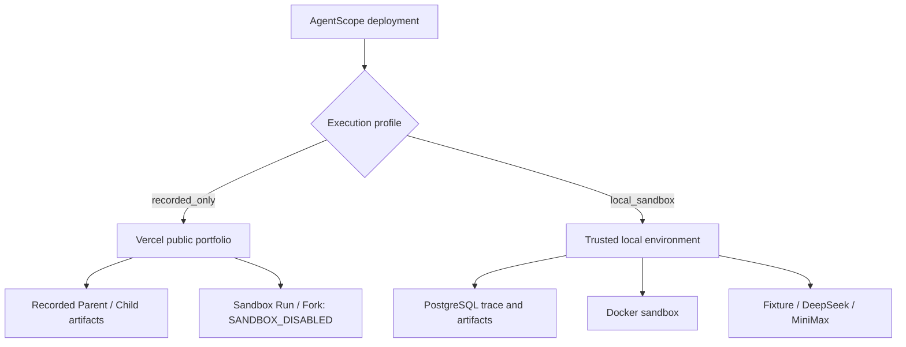
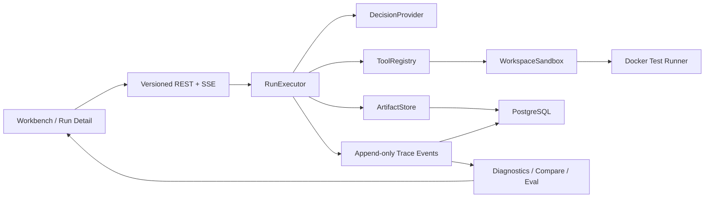

# AgentScope 架构说明

## 1. 架构目标

AgentScope 的系统目标不是“展示更多日志”，而是保证四件事同时成立：

1. Agent 的模型与工具循环能被统一记录；
2. 失败诊断和 Eval 结论可以回到原始 Span；
3. Fork 不修改 Parent，且只能从安全 Checkpoint 恢复；
4. 录制回放、确定性执行和真实模型执行在产品与代码中边界清晰。

当前采用 Next.js + PostgreSQL 模块化单体。执行、持久化、分析和 UI 位于同一仓库，但通过领域接口隔离，避免把代码审计专用的 `AuditTraceSession` 扩张成通用 Runtime。

公开部署与本地开发使用同一代码包，但由 `AGENTSCOPE_EXECUTION_PROFILE` 划分可信边界：



## 2. 模块边界



### Execution Domain

- `RunExecutor.execute(spec)` 驱动 Agent 循环并输出统一 `RunStreamMessage`。
- `DecisionProvider.next(context)` 只能返回 Zod 校验后的结构化动作。
- `ToolRegistry` 只注册 `read_file`、`search_code`、`apply_patch`、`run_tests`。
- `WorkspaceSandbox` 负责工作区隔离、路径校验、Patch 白名单和 Snapshot。
- `ArtifactStore` 负责内容限制、脱敏、Hash、可见性与持久化。

`fixture`、`deepseek`、`minimax` 共享同一执行器。Provider 不能覆盖测试命令，也不能生成任意 Shell。

### Trace Domain

`Run / Span / Event / Artifact / Checkpoint` 是稳定领域模型。事件采用追加写，Projection 可由事件重建；旧 Bundle Schema 与旧审计 Trace 保持兼容。

### Analysis Domain

- Diagnostics：首次未恢复失败、重复调用、无进展循环、延迟和 Token 热点。
- Compare：对齐路径并输出事实型 `Resolved / Regressed / Trade-off`。
- Eval：依据运行终态、目标测试、Patch、范围、安全和工具可靠性打分。

分析结果只引用 `evidenceSpanIds`，不依赖隐藏推理或模型自评。

## 3. 代码修复场景

本轮只支持仓库内置 `buggy-auth-api`：

- Fixture 文件由 Scenario Manifest 声明；
- 可修改文件只有 `src/auth.ts`；
- 测试命令由服务端固定；
- 每个 Run 使用独立临时目录；
- Checkpoint 保存 Fixture 版本、累计 Patch、工具版本和 Workspace Snapshot 引用；
- Child 通过 Snapshot 恢复，Parent 的事件、投影和工作区保持不变。

Docker 运行测试时采用非 root 用户、关闭网络、只读工作区挂载、临时 `/tmp`、CPU/内存/PID 与超时限制。

## 4. Artifact 与安全

支持 `text/plain`、`application/json`、`text/x-diff`：

- 单 Artifact 最大 256KB；
- 单 Run 最大 1MB；
- 持久化前执行 Secret 脱敏；
- 用户 Artifact 可由内容接口读取；
- Workspace Snapshot 标记为 internal，默认不进入导出 Bundle。

Trace 保存 Artifact 元数据与 Hash，不把大内容直接塞入 Span。

## 5. API 与可靠性

关键接口：

```text
POST /api/v1/runs
GET  /api/v1/runs/:runId/stream
POST /api/v1/runs/:runId/replay-preflight
POST /api/v1/runs/:runId/forks
GET  /api/v1/artifacts/:artifactId
GET  /api/v1/system/capabilities
```

Run 与 Fork 支持 `Idempotency-Key`。SSE 事件带稳定 sequence，客户端按事件 ID 去重，并可在刷新或断线后从 PostgreSQL 补拉。进程中断的运行会被收敛为明确错误终态。

## 6. 产品路由

- `/`：旗舰入口与能力检测；
- `/demos/code-fix-loop`：固定录制演示；
- `/case-study`：产品、架构、安全与验证案例说明；
- `/runs/:runId`：持久 Run 深链接；
- `/audit`：原代码审计工作台。

共享服务端事实以 Run Projection 为准，前端不引入新的全局状态库。

## 7. 公开部署质量边界

`recorded_only` 是 Production 默认值：

- 能力接口不探测 Docker，所有 Live Provider 标记为不可用；
- Sandbox Run 与 Fork 在数据库访问前返回稳定 `SANDBOX_DISABLED`；
- 页面和录制 Artifact 不依赖数据库、Docker 或模型密钥；
- Production Smoke 验证首页、Demo、Case Study、能力接口、拒绝路径和 Artifact；
- axe 检查首页、Demo、Compare、Eval 与 Case Study；
- Lighthouse 约束 Performance、Accessibility、LCP 和 Console Error。

## 8. 明确非目标

- 任意用户仓库或不可信代码执行；
- 登录、RBAC、多租户、计费和团队协作；
- 独立 Worker、消息队列和分布式调度；
- Dataset、批量实验、趋势看板和 LLM-as-a-Judge；
- TypeScript/Python SDK 与 OTLP 导入。
